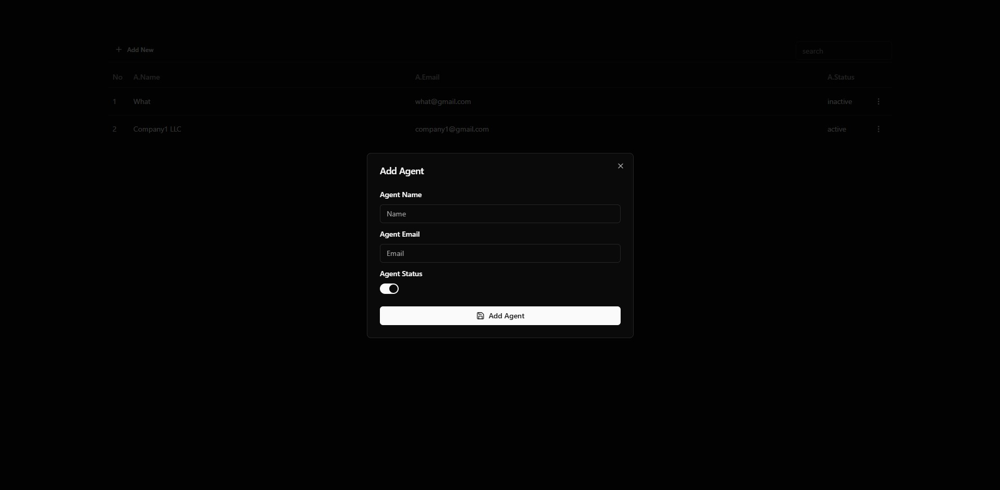

### Features Implemented

#### Must-Have Features
- Implemented all Must-Have features.

#### Additional Features
- **Search and Filter**: Allows users to easily find relevant information.
- **Responsive Design**: Ensures the app works seamlessly across different devices.
- **Agent Details Page**: Displays detailed information about agent.
- **Persistent Storage**: Saves user data to maintain state.
- **API Integration**: Fetches and updates data dynamically from an external API.

---

### How to Start the Project

1. Install dependencies:
   ```bash
   npm install
---
2. Install json-server globally
   ```bash
   npm install --global json-server
2. Run the project:
   ```bash
   npm start
---

## Screenshots




## Video Demo
[Watch the demo here](https://www.loom.com/share/b3bc56ca33a84d97bec830a47f3ee0d3?sid=efc738bb-7dea-461f-aacc-19584978da64)
